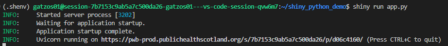

# shiny_python_demo
Shiny is available in Python (Ref [https://shiny.posit.co/py/](https://)) and you can find some examples there.

This project is using some specific packages versions. More detail in requirements.txt file.

This example focus on shiny core. There is another way to create controls (shiny.express).

This example uses the happiness data. Check WHR2024.csv in data folder

There are some Plotly examples like bar, area and cloropleth

Previous steps to prepare your VS Code for Python here: https://github.com/Public-Health-Scotland/vscode_prep

Don't forget to activate your environment to run this example
You only need to type on terminal shiny run app.py

If you want to publish to shinyapps.io you need to install rsconnect-python in your environment
You will need to run the following commands:
- Register your credentials

`rsconnect add --name <your-account-name> --token <your-token> --secret <your-secret>`

- Deploy your app. If you are in the current app folder use ".", otherwise you should type the app_path

`rsconnect deploy shiny --title "My Shiny App" .`

## Comment
- Python shiny natively support async functions
- Python shiny has a ui.input_dark_mode (not in R shiny)
- Python shiny has a ui.card (You have to install BSLIB in R)
